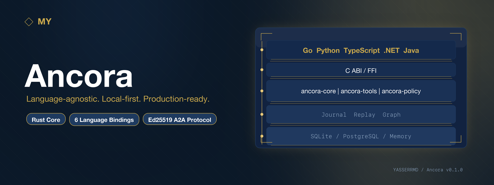
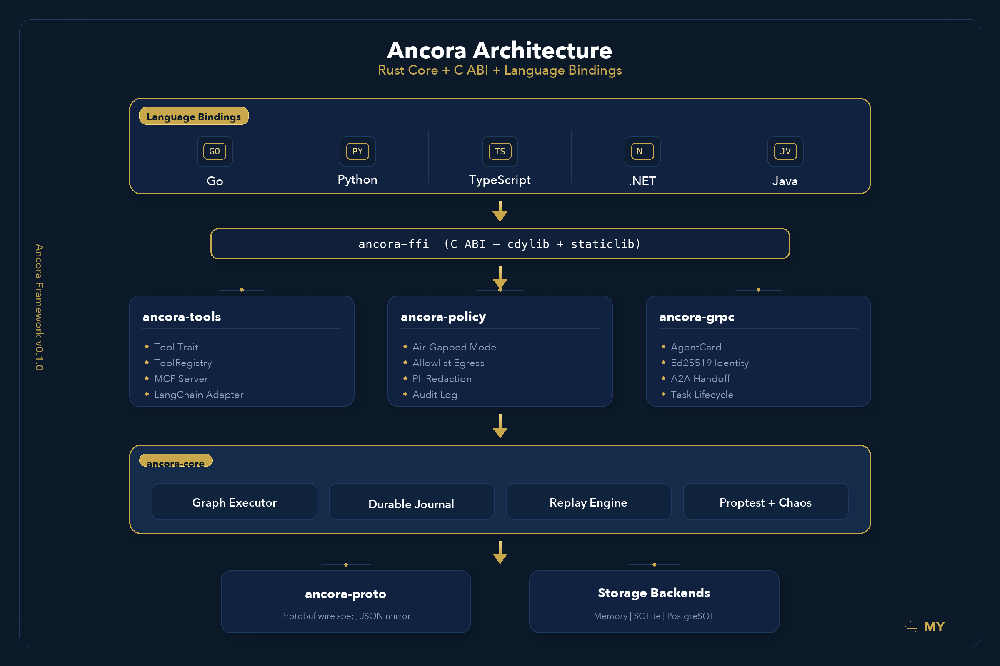

<div align="center">



<br/>

[](https://github.com/YASSERRMD/Ancora/actions/workflows/build.yml)
[](https://github.com/YASSERRMD/Ancora/actions/workflows/test.yml)
[](https://github.com/YASSERRMD/Ancora/actions/workflows/clippy.yml)
[](LICENSE)
[](CHANGELOG.md)

**Language-agnostic. Local-first. Production-ready.**

[Quickstarts](docs/quickstarts/index.md) |
[Architecture](docs/spec/architecture.md) |
[Guides](docs/guides/) |
[Security](docs/security/threat-model.md) |
[Changelog](CHANGELOG.md)

</div>

---

## What is Ancora?

Ancora is an **open-source agentic framework** built on a Rust core and exposed
to every major language through a stable **C ABI**. It prioritises correctness,
durability, and sovereignty over ease-of-use shortcuts.

| Property | Detail |
|----------|--------|
| **Local-first** | Defaults to Ollama / llama.cpp; cloud providers are additive |
| **Durable by default** | Append-only journal with exactly-once replay on crash |
| **Language-agnostic** | One engine, six bindings, zero drift |
| **Air-gapped capable** | Policy engine blocks all egress at the framework layer |
| **Protocol-native** | A2A agent cards, Ed25519 identity, MCP tool server |

---

## Architecture

<div align="center">

</div>

<br/>

The framework is structured in five layers:

```
Language Bindings   Go | Python | TypeScript | .NET | Java
                    ─────────────────────────────────────
C ABI               ancora-ffi  (cdylib + staticlib)
                    ─────────────────────────────────────
Service Crates      ancora-tools  ancora-policy  ancora-grpc
                    ─────────────────────────────────────
Core Engine         ancora-core  (graph, journal, replay)
                    ─────────────────────────────────────
Proto / Storage     ancora-proto  |  SQLite / PostgreSQL
```

Full diagram: [docs/spec/architecture.md](docs/spec/architecture.md)

---

## Quick start

Pick your language:

**Rust**
```toml
[dependencies]
ancora-core = "0.1"
```
```rust
use ancora_core::runner::run_graph;
let journal = run_graph(&graph, "summarise this article").await?;
```

**Python**
```bash
pip install ancora
```
```python
from ancora import Runtime
result = Runtime().run("summarise this article")
```

**TypeScript**
```bash
npm install @ancora/sdk
```
```typescript
import { Runtime } from "@ancora/sdk";
const result = await new Runtime().run("summarise this article");
```

**Go**
```bash
go get ancora.io/sdk
```
```go
rt, _ := ancora.NewRuntime()
result, _ := rt.Run("summarise this article")
```

Full per-language quickstarts: [docs/quickstarts/index.md](docs/quickstarts/index.md)

---

## Crate overview

| Crate | Description |
|-------|-------------|
| `ancora-core` | Graph executor, durable journal, replay, chaos tests, benchmarks |
| `ancora-proto` | Protobuf wire spec and JSON mirror for journal events |
| `ancora-ffi` | C ABI surface -- every language binding links this |
| `ancora-tools` | `Tool` trait, `ToolRegistry`, MCP server, LangChain adapter |
| `ancora-policy` | Air-gapped egress, data-residency allowlists, PII redaction |
| `ancora-grpc` | A2A agent cards, Ed25519 identity, task lifecycle, handoff |

Language bindings: `sdk/go` `sdk/python` `sdk/ts` `sdk/dotnet` `sdk/java`

---

## Durability and replay

Every run is recorded in an append-only journal. On crash and restart the
engine reconstructs state from the journal and resumes from the last
durable checkpoint -- no duplicated side effects, no lost work.

```rust
// The engine skips activities already recorded in the journal.
// Re-run with the same run_id after a crash -- it just works.
let journal = run_graph(&graph, "run-42", input).await?;
```

Detailed explanation: [docs/guides/durability.md](docs/guides/durability.md)

---

## Security and governance

Ancora ships with a policy engine that enforces governance at the framework
layer, not the tool layer.

```rust
use ancora_policy::policy::Policy;

// Air-gapped: block all outbound calls unconditionally.
let policy = Policy::new().air_gapped();

// Data residency: only EU endpoints.
let policy = Policy::new().allow_endpoint("https://eu.api.example.com");
```

Security threat model: [docs/security/threat-model.md](docs/security/threat-model.md)

Governance guide: [docs/guides/governance.md](docs/guides/governance.md)

---

## A2A protocol

Agents expose themselves via a signed agent card at `/.well-known/agent.json`.
Cross-agent task delegation uses Ed25519-verified identity.

```rust
let identity = AgentIdentity::generate();
let card = AgentCard { name: "my-agent".into(), ..Default::default() };
let signed = sign_card(&identity, &card);

let client = A2aClient::new("remote-host", 8080);
client.fetch_and_verify_card().await?; // rejects unsigned cards
```

---

## MCP tool server

Ancora's `ToolRegistry` is exposed over HTTP JSON-RPC 2.0 with optional
bearer-token authentication.

```rust
let server = McpServer::new(registry).with_token("s3cr3t");
server.serve("0.0.0.0:3001".parse()?, shutdown_rx).await?;
```

---

## Running tests

```bash
# All Rust tests
cargo test --workspace

# Benchmarks
cargo bench -p ancora-core

# Cross-language conformance
bash test/xlang/run-all.sh

# Chaos and crash tests
cargo test -p ancora-core chaos
```

---

## Platforms and versions

| Binding | Minimum |
|---------|---------|
| Rust (MSRV) | 1.75 |
| Go | 1.22 |
| Python | 3.9 |
| TypeScript | Node.js 18 |
| .NET | 8.0 |
| Java | 17 (LTS) |

Full matrix: [docs/spec/platforms.md](docs/spec/platforms.md)

---

## Documentation

| Guide | Description |
|-------|-------------|
| [Architecture](docs/spec/architecture.md) | Layers, crates, data flow |
| [Quickstarts](docs/quickstarts/index.md) | Code examples for all 6 languages |
| [Orchestration](docs/guides/orchestration.md) | Graphs, branching, parallel nodes |
| [Memory](docs/guides/memory.md) | Within-run and cross-run state |
| [Durability](docs/guides/durability.md) | Crash recovery, exactly-once replay |
| [Observability](docs/guides/observability.md) | OpenTelemetry spans, cost tracking |
| [Governance](docs/guides/governance.md) | Air-gapped mode, PII, audit |
| [Security](docs/security/threat-model.md) | Threat model T1-T6 |
| [Benchmarks](docs/benchmarks.md) | Performance methodology and results |
| [Migration from LangGraph](docs/migration/from-langgraph.md) | Porting guide |
| [Migration from CrewAI](docs/migration/from-crewai.md) | Porting guide |

---

## Changelog

See [CHANGELOG.md](CHANGELOG.md) for the full release history.

---

## Contributing

See [CONTRIBUTING.md](CONTRIBUTING.md) for commit conventions, branch
strategy, and the phase-based development process.

---

## License

Apache-2.0. See [LICENSE](LICENSE).

---

<div align="center">

Built by [YASSERRMD](https://github.com/YASSERRMD)

</div>
